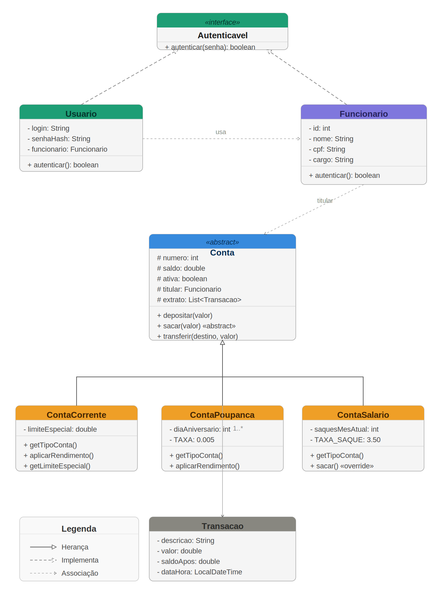

# UNIVERSIDADE CATÓLICA DE PERNAMBUCO
<p align="center">
   
</p>

## Índice

- [Sobre o Projeto](#sobre-o-projeto)
- [Estrutura de Pacotes](#estrutura-de-pacotes)
- [Funcionalidades](#funcionalidades)
- [Conceitos de POO Aplicados](#conceitos-de-poo-aplicados)
- [Como Compilar e Executar](#como-compilar-e-executar)
- [Diagrama UML](#diagrama-uml)
- [Tipos de Contas](#tipos-de-conta)
- [Licença](#licença)

---

## Sobre o Projeto

Sistema bancário digital em **Java puro** voltado para funcionários da UNICAP. Roda no terminal e aplica os principais conceitos de POO: herança, polimorfismo, encapsulamento, interfaces, classes abstratas, coleções e tratamento de exceções.

---

## Estrutura de Pacotes

```
src/
└── br/unicap/banco/
    ├── app/
    │   ├── Main.java          ← Ponto de entrada
    │   └── Menu.java          ← Interface de terminal (todos os menus)
    ├── modelo/
    │   ├── Autenticavel.java  ← Interface de autenticação
    │   ├── Conta.java         ← Classe abstrata base
    │   ├── ContaCorrente.java ← Herda Conta (cheque especial)
    │   ├── ContaPoupanca.java ← Herda Conta (rendimento 0,5%/mês)
    │   ├── ContaSalario.java  ← Herda Conta (1 saque gratuito/mês)
    │   ├── Funcionario.java   ← Entidade principal do sistema
    │   ├── Transacao.java     ← Registro de extrato
    │   └── Usuario.java       ← Implementa Autenticavel (login/senha)
    ├── servico/
    │   └── Banco.java         ← Serviço central (gerencia tudo)
    └── excecoes/
        ├── AutenticacaoException.java
        ├── ContaInativaException.java
        ├── FuncionarioNaoEncontradoException.java
        └── SaldoInsuficienteException.java
```

---

## Funcionalidades

| # | Funcionalidades |
|---|---|
| 1 | Cadastrar funcionários |
| 2 | Criar contas bancárias (Corrente, Poupança, Salário) |
| 3 | Consultar saldo |
| 4 | Realizar depósito |
| 5 | Realizar saque |
| 6 | Realizar transferências entre contas |
| 7 | Exibir extrato com histórico de transações |
| 8 | Listar funcionários e contas |
| 9 | Encerrar conta |
| 10 | Autenticação com login e senha |

---

## Conceitos de POO Aplicados

| Conceito | Onde está aplicado |
|---|---|
| **Classes e Objetos** | Todas as classes do pacote `modelo` |
| **Encapsulamento** | Atributos `private`/`protected` com getters/setters |
| **Herança** | `ContaCorrente`, `ContaPoupanca`, `ContaSalario` herdam de `Conta` |
| **Polimorfismo** | `getTipoConta()`, `aplicarRendimento()`, `sacar()` sobrescritos |
| **Interface** | `Autenticavel` implementada por `Usuario` |
| **Classe Abstrata** | `Conta` com métodos `abstract` |
| **Sobrescrita de métodos** | `@Override` em todas as subclasses de `Conta` |
| **Coleções Java** | `HashMap`, `ArrayList`, `List`, `Collection` |
| **Tratamento de Exceções** | 4 exceções customizadas + `try/catch` em todas operações |
| **Organização em pacotes** | `modelo`, `servico`, `excecoes`, `app` |

---

## Como Compilar e Executar

### Pré-requisitos
- Java 17 ou superior (recomendado: Java 21)

### Via terminal (Linux / macOS / Git Bash)

```bash
# 1. Clone o repositório
git clone https://github.com/SEU_USUARIO/banco-unicap.git
cd banco-unicap

# 2. Compile
javac -d out -sourcepath src $(find src -name "*.java")

# 3. Execute
java -cp out br.unicap.banco.app.Main
```

### Via terminal (Windows CMD / PowerShell)

```cmd
REM 1. Clone e entre na pasta
git clone https://github.com/SEU_USUARIO/banco-unicap.git
cd banco-unicap

REM 2. Compile (PowerShell)
$files = Get-ChildItem -Path src -Recurse -Filter "*.java" | Select-Object -ExpandProperty FullName
javac -d out -sourcepath src $files

REM 3. Execute
java -cp out br.unicap.banco.app.Main
```

---

## Contas de Demonstração

O sistema já inicia com dois funcionários cadastrados para testes:

| Login | Senha | Nome | Cargo |
|---|---|---|---|
| `ana` | `1234` | Ana Souza | Professora |
| `carlos` | `5678` | Carlos Lima | Técnico Administrativo |

> Ana já possui uma Conta Corrente (#1001) com saldo de R$ 3.500,00.  
> Carlos já possui uma Conta Poupança (#1002) com saldo de R$ 1.200,00.

---

## Diagrama UML



---

## Tipos de Conta

### Conta Corrente
- Limite de cheque especial configurável (padrão: R$ 500,00)
- Taxa de manutenção de R$ 12,00/mês

### Conta Poupança
- Rendimento automático de **0,5% ao mês** sobre o saldo
- Sem taxa de manutenção

### Conta Salário
- **1 saque gratuito por mês**
- Saques adicionais: taxa de R$ 3,50 por operação
- Sem rendimento

## Autores

Desenvolvido por **LUANA LIRA** & **ALLAN HENRIQUE**

---

## Licença

Distribuído sob a licença MIT. Veja o arquivo [LICENSE](LICENSE) para mais detalhes.

---
